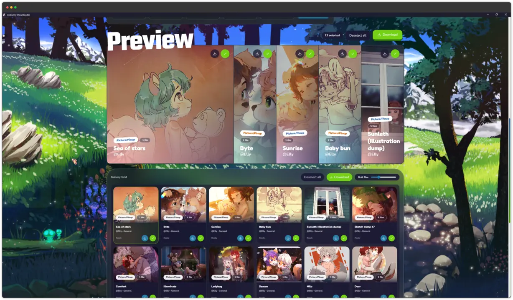
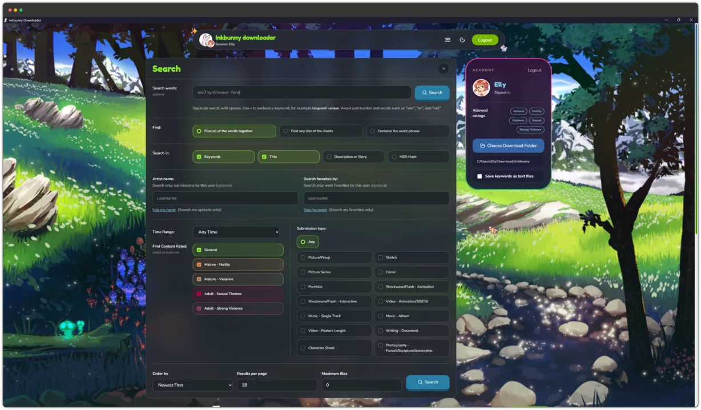
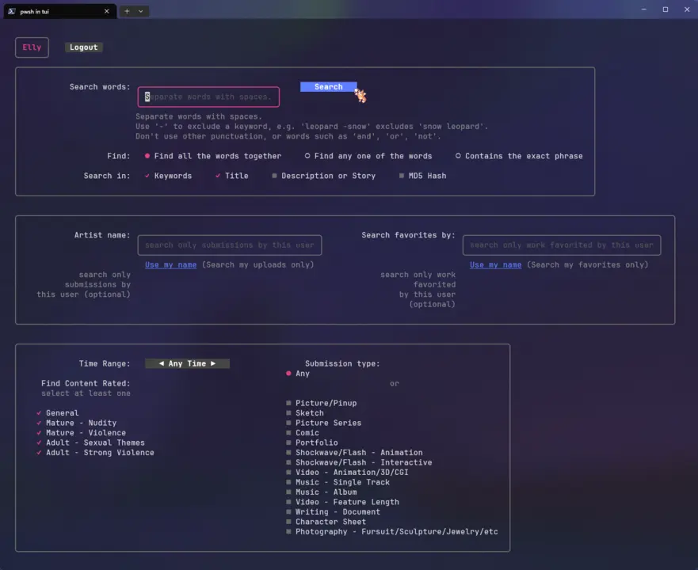
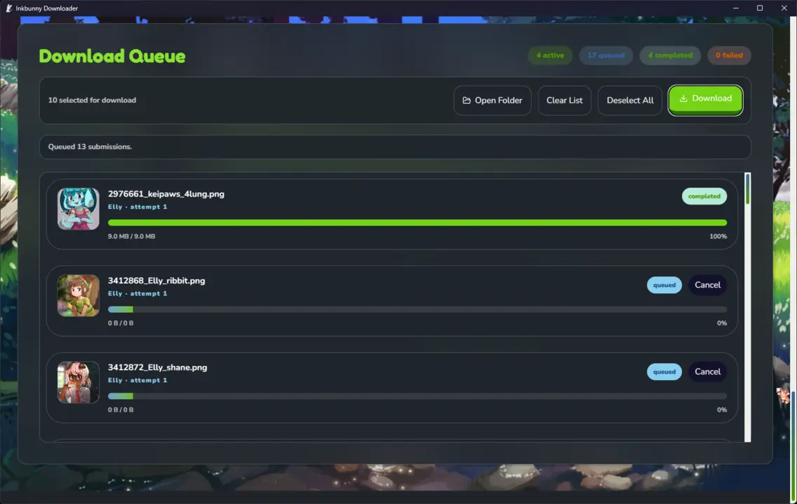

<p align="center">
  
  
  <br>
  <h1 align="center">Inkbunny Downloader</h1>
</p>

<p align="center">
  <a href="https://github.com/ellypaws/inkbunny-downloader/releases">
    
  </a>
  <a href="https://github.com/ellypaws/inkbunny-downloader/actions/workflows/release.yml">
    
  </a>
  <a href="https://github.com/ellypaws/inkbunny-downloader/releases">
    
  </a>
  <a href="https://github.com/ellypaws/inkbunny-downloader/releases/latest/download/inkbunny-downloader-windows.exe">
    
  </a>
  <a href="https://github.com/ellypaws/inkbunny-downloader/releases">
    
  </a>
  <a href="https://github.com/ellypaws/inkbunny-downloader">
    
  </a>
  <br>
  <a href="https://inkbunny.net/">
    
  </a>
  <a href="https://wiki.inkbunny.net/wiki/API">
    
  </a>
  <a href="https://github.com/ellypaws/inkbunny">
    
  </a>
  <a href="https://github.com/ellypaws/inkbunny-downloader/releases">
    
  </a>
</p>

--------------

<p align="right"><i>Disclaimer: This project is not affiliated with or endorsed by Inkbunny.</i></p>

Inkbunny Downloader is a desktop and terminal app for searching Inkbunny, reviewing results, and downloading files in bulk with a queue you can control.



> [!NOTE]
> This is an unofficial project. It uses the public Inkbunny API, but it is not affiliated with or endorsed by Inkbunny.

> [!IMPORTANT]
> If you want to log in with your own account, you must enable API access in your Inkbunny account settings first: https://inkbunny.net/account.php

## Why Use It?

- Search by keywords, title, description, or MD5.
- Filter by artist, favorites, time range, sort order, and submission type.
- Switch between a desktop app, terminal UI, or headless CLI workflow.
- Queue multiple downloads and control concurrent jobs.
- Save submission keywords beside downloads as `.txt` files if you want captions.
- Reuse saved sessions so you do not need to log in every time.

## Installation

The easiest way to install the downloader is from [GitHub Releases](https://github.com/ellypaws/inkbunny-downloader/releases):

<a href="https://github.com/ellypaws/inkbunny-downloader/releases">

</a>
<a href="https://github.com/ellypaws/inkbunny-downloader/releases/latest/download/inkbunny-downloader-windows.exe">

</a>

### Windows

For the desktop app, download:

- `inkbunny-downloader-windows.exe`

For the terminal version, download:

- `inkbunny-downloader-tui-windows.exe`

Suggested setup:

1. Create a folder for the app.
2. Move the downloaded `.exe` into that folder.
3. Run it directly.

### Linux

For the desktop app, download:

- `inkbunny-downloader-linux-amd64`

For the terminal version, download:

- `inkbunny-downloader-tui-linux-amd64`

Then make it executable:

```bash
chmod +x inkbunny-downloader-linux-amd64
chmod +x inkbunny-downloader-tui-linux-amd64
```

Run it with:

```bash
./inkbunny-downloader-linux-amd64
```

or:

```bash
./inkbunny-downloader-tui-linux-amd64
```

> [!NOTE]
> The Linux desktop build may need the usual WebKitGTK/GTK desktop runtime packages available on your system. If you want the simplest portable option on Linux, use the TUI build.

## First Run

1. Start the desktop app or terminal build.
2. Log in with your Inkbunny username and password, or continue as a guest.
3. Choose which content ratings you want the API session to show.
4. Pick a download folder.
5. Search, review results, select files, and enqueue downloads.

## Account Setup

To use your own account through the API:

1. Log in on Inkbunny.
2. Open Account Settings.
3. Enable API access.
4. Return to the downloader and sign in.

> [!IMPORTANT]
> Rating changes made through the API affect the current API session. They do not permanently change your normal site preferences.

## App Modes

### Desktop App

The desktop app is the main end-user experience. It gives you:

- Search forms with filters and autocompletion.
- A visual results grid with previews.
- A download queue panel with progress tracking.
- Download folder, theme, motion, and concurrency settings.



Launch the desktop app by starting the desktop release binary with no extra setup.

### Terminal UI

The TUI is useful if you want an interactive workflow without the desktop shell.

On Windows:

```powershell
.\inkbunny-downloader-tui-windows.exe
```

On Linux:

```bash
./inkbunny-downloader-tui-linux-amd64
```



### Headless CLI

If you prefer scripts or one-shot commands, you can pass flags and run headless.

Example:

```bash
inkbunny-downloader-tui-linux-amd64 --search "fox -comic" --artist "artist_name" --order favs --limit 25 --caption
```

Useful flags:

- `--search` search text, including exclusions like `tag -excludedtag`
- `--join` combine terms with `and`, `or`, or `exact`
- `--in` choose search fields such as `keywords,title,description,md5`
- `--artist` limit results to one artist
- `--favby` search work favorited by a user
- `--time` limit results to the last N days
- `--type` choose a submission type such as `pinup`, `sketch`, or `comic`
- `--order` sort by `create_datetime`, `favs`, or `views`
- `--limit` cap how many submissions are downloaded
- `--active` set max concurrent downloads
- `--caption` save keywords to `.txt`
- `--tui` force terminal UI mode
- `--headless` force non-interactive mode

## Download Behavior

- The desktop app lets you choose a download directory in settings.
- The queue can run multiple downloads in parallel.
- Existing files are skipped where possible rather than downloaded again.
- Some submissions contain multiple files, and those are queued separately.
- If keyword saving is enabled, the app writes a sibling `.txt` file beside the downloaded file.



## Troubleshooting

### Login fails

- Make sure API access is enabled in your Inkbunny account settings.
- Confirm your username and password are correct.
- If a saved session has expired, log out and sign in again.

### I can search as guest but not see everything

- Guest access is limited.
- Log in and update your session ratings if you need access to more content categories.

### Linux desktop app does not start

- Try the TUI build first.
- If you need the desktop build, install the required GTK/WebKit runtime packages for your distribution.

## Privacy And Safety Notes

- This app stores session data locally so it can restore your last session.
- Downloads may include mature content depending on the ratings you enable.
- Always follow Inkbunny's rules and the creator permissions that apply to the files you download.